# Задача

- 1.3.1. Построение графиков в Octave
- 1.3.2. Разложение импульсного сигнала в частичный ряд Фурье
- 1.3.3. Определение спектра и параметров сигнала
- 1.3.4. Амплитудная модуляция
- 1.3.5. Кодирование сигнала. Исследование свойства самосинхронизации сигнала

# Построение графиков в Octave

### Простой пример
```octave
x=-10:0.1:10;
y1=sin(x)+1/3*sin(3*x)+1/5*sin(5*x);
plot(x,y1, "-ok; y1=sin(x)+(1/3)*sin(3*x)+(1/5)*sin(5*x);","markersize",4)
grid on;
xlabel('x');
ylabel('y');
title('y1=sin x+ (1/3)sin(3x)+(1/5)sin(5x)');
print ("plot-sin.eps", "-mono", "-FArial:16", "-deps")
print("plot-sin.png");
```
## График
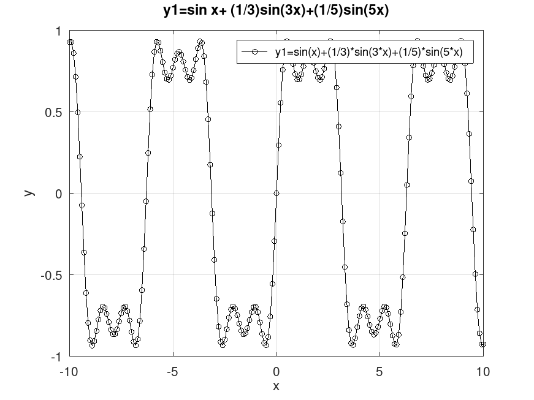

## Несколько графиков
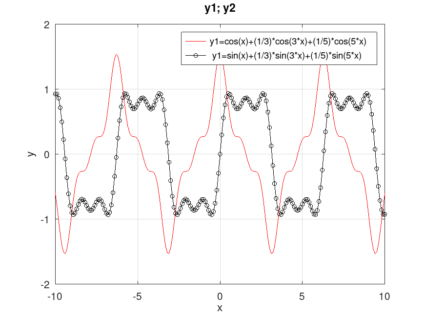

# Разложение импульсного сигнала в частичный ряд Фурье
```octave
N=8;
t=-1:0.01:1;
A=1;
T=1;

nh=(1:N)*2-1;
Am=2/pi ./ nh;

harmonics=sin(2 * pi * nh' * t/T);
s1=harmonics.*repmat(Am',1,length(t));

s2=cumsum(s1);
for k=1:N
subplot(4,2,k)
plot(t, s2(k,:))
end

print("plot-meandros.png");
```
## График
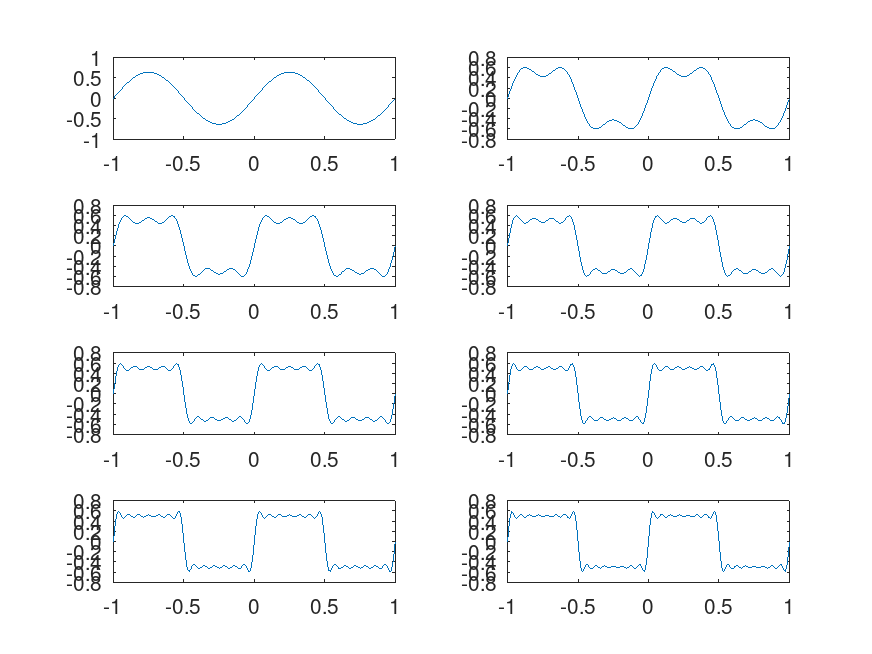

# Определение спектра и параметров сигнала

## Графики сигналов
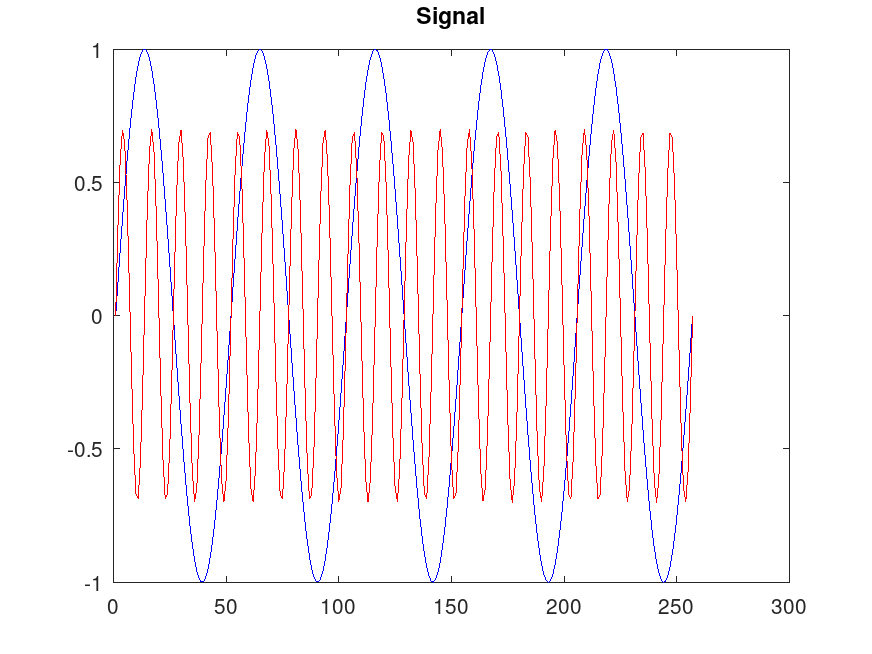

## График спектра
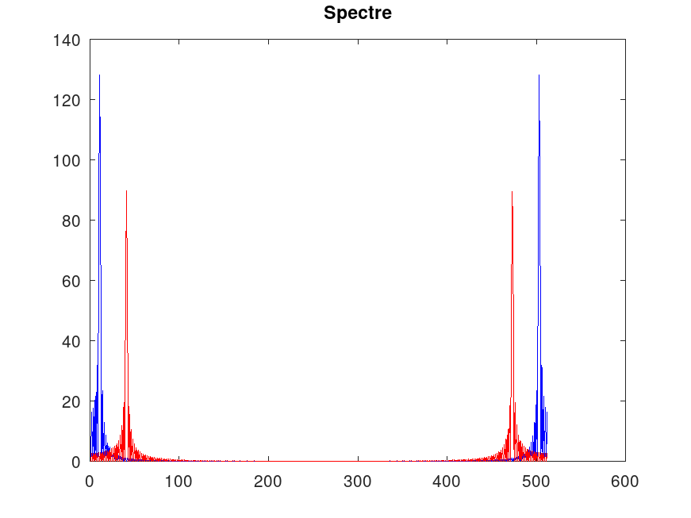

## График спектра с отброшеными дублирующими частотами
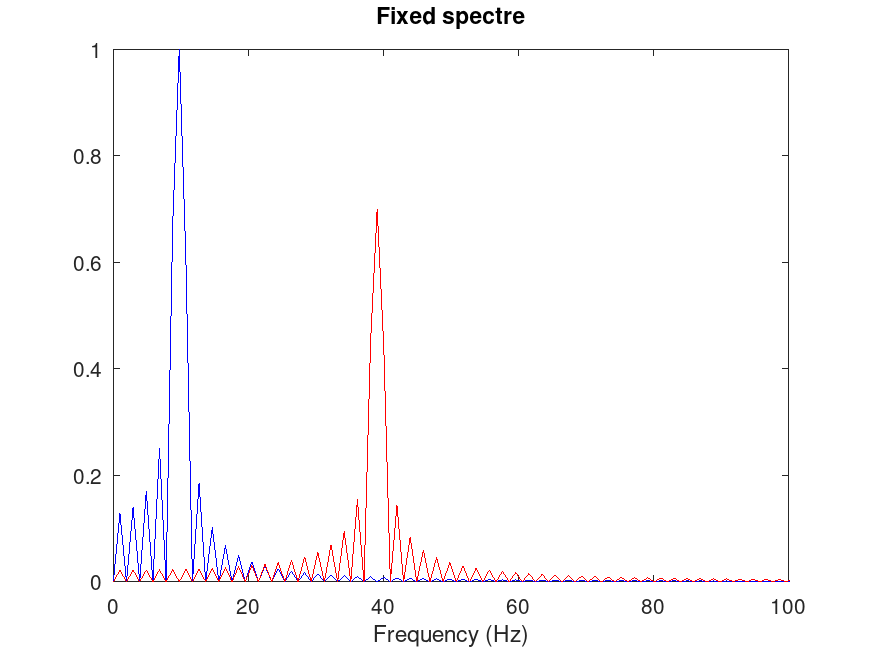

## Суммарный сигнал
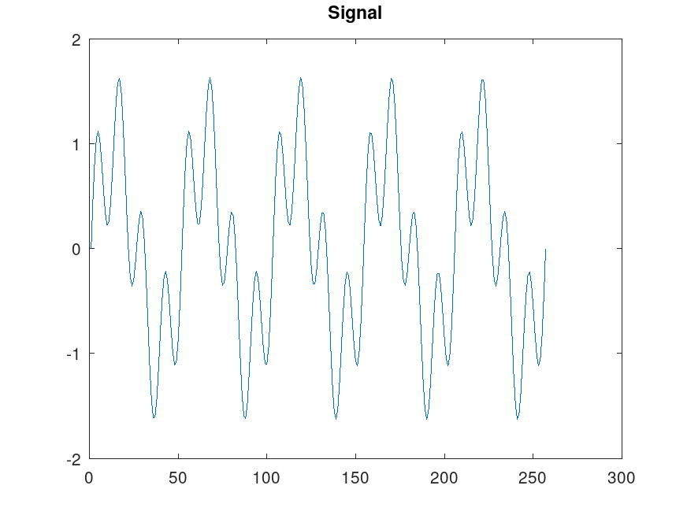

## Суммарный спектр
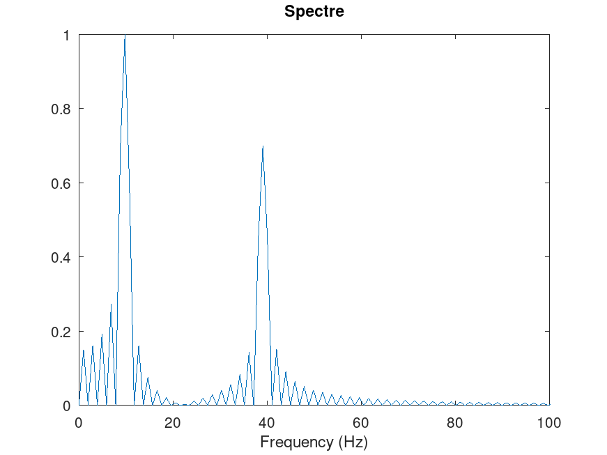

# Амплитудная модуляция

## График сигнала
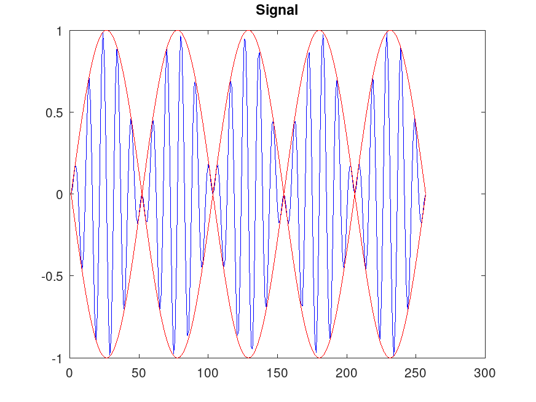
## График спектра
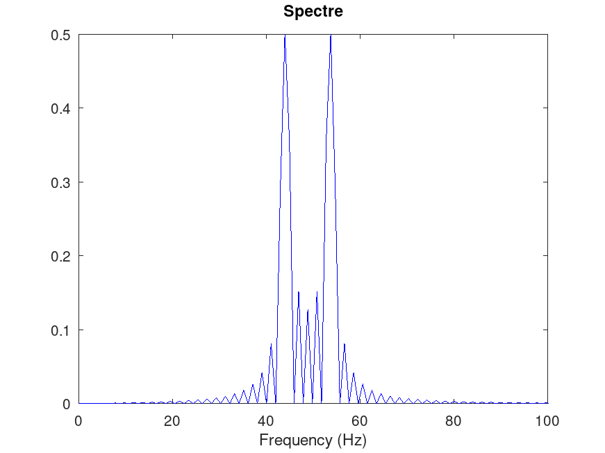

# Кодирование сигнала. Исследование свойства самосинхронизации сигнала

## Manchester 
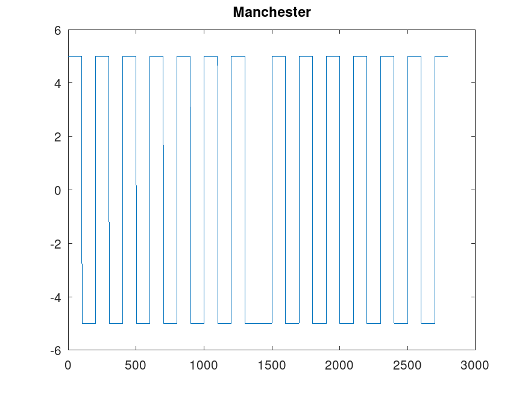

## Unipolar
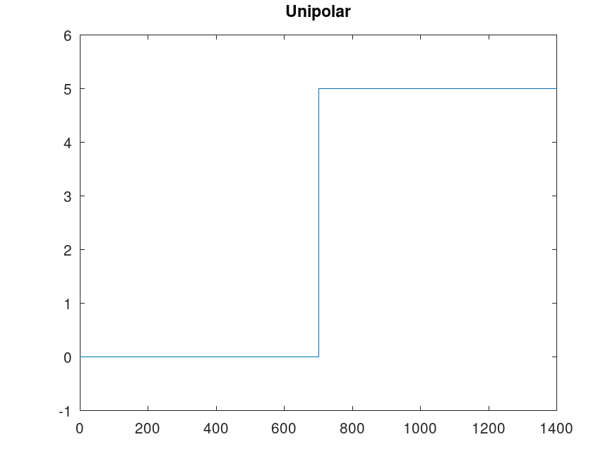

## Ripolar Return-to-Zero
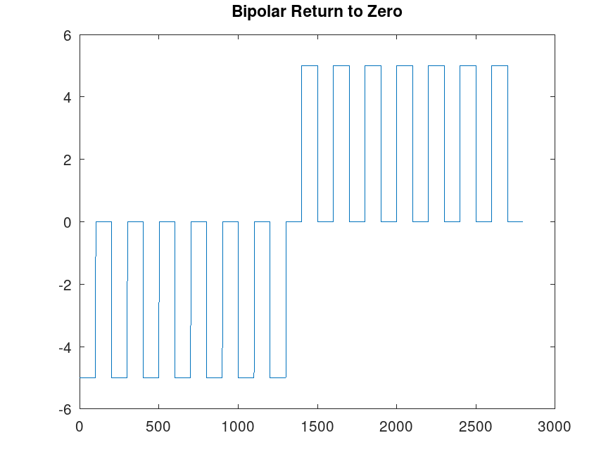

# Вывод

Я получил опыт работы с Octave для расчета и визуализации данных на примере сигналов и их модуляции.
