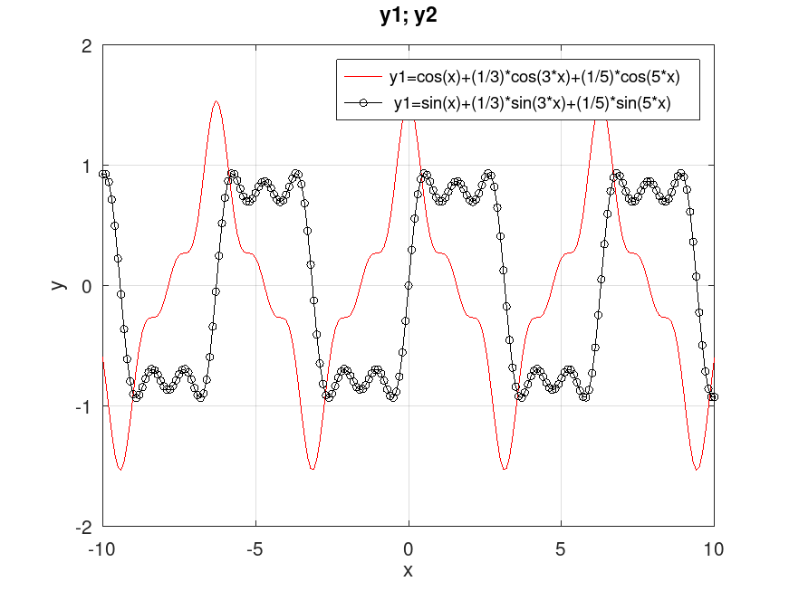
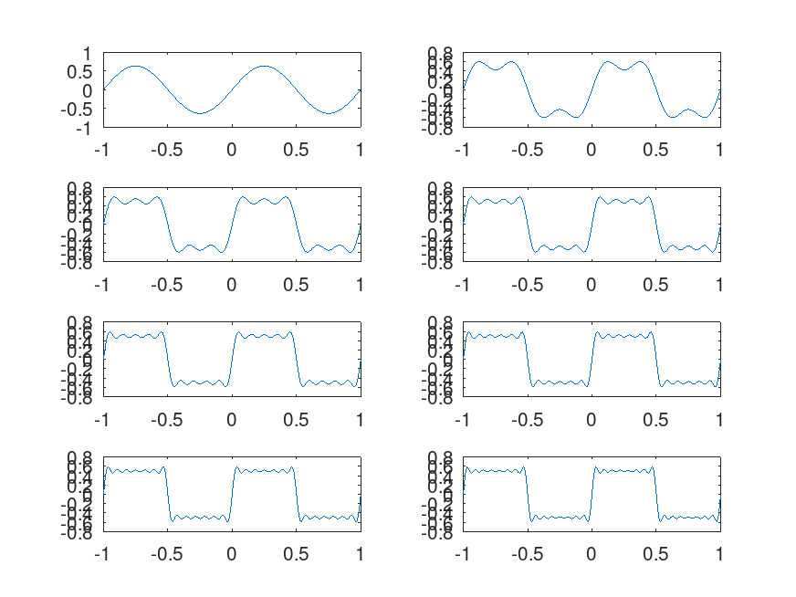
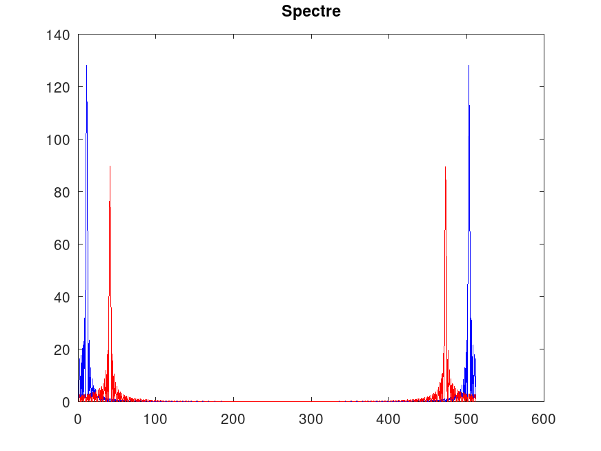
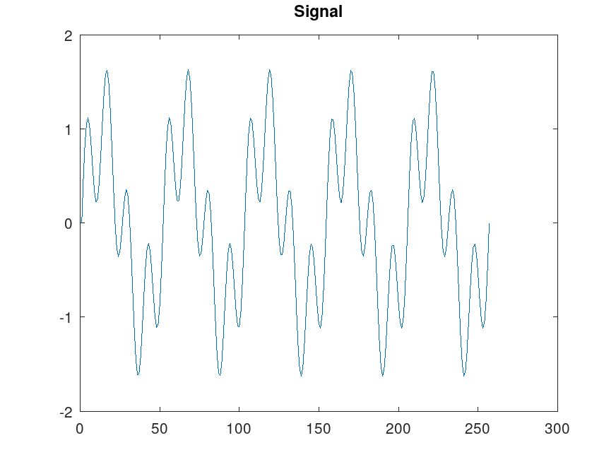

---
## Front matter
title: "Отчет по лабораторной работе 1"
subtitle: ""
author: "Матюхин Григорий, НПИбд-01-21, 1032211403"

## Generic otions
lang: ru-RU
toc-title: "Содержание"

## Pdf output format
toc: true # Table of contents
toc-depth: 2
lof: true # List of figures
lot: true # List of tables
fontsize: 12pt
linestretch: 1.5
papersize: a4
documentclass: scrreprt
## I18n polyglossia
polyglossia-lang:
  name: russian
  options:
	- spelling=modern
	- babelshorthands=true
polyglossia-otherlangs:
  name: english
## I18n babel
babel-lang: russian
babel-otherlangs: english
## Fonts
mainfont: PT Serif
romanfont: PT Serif
sansfont: PT Sans
monofont: PT Mono
mainfontoptions: Ligatures=TeX
romanfontoptions: Ligatures=TeX
sansfontoptions: Ligatures=TeX,Scale=MatchLowercase
monofontoptions: Scale=MatchLowercase,Scale=0.9
## Biblatex
biblatex: true
biblio-style: "gost-numeric"
biblatexoptions:
  - parentracker=true
  - backend=biber
  - hyperref=auto
  - language=auto
  - autolang=other*
  - citestyle=gost-numeric
## Pandoc-crossref LaTeX customization
figureTitle: "Рис."
tableTitle: "Таблица"
listingTitle: "Листинг"
lofTitle: "Список иллюстраций"
lotTitle: "Список таблиц"
lolTitle: "Листинги"
## Misc options
indent: true
header-includes:
  - \usepackage{indentfirst}
  - \usepackage{float} # keep figures where there are in the text
  - \floatplacement{figure}{H} # keep figures where there are in the text
---

# Цели работы
Изучение методов кодирования и модуляции сигналов с помощью высоко-
уровнего языка программирования Octave. Определение спектра и параметров
сигнала. Демонстрация принципов модуляции сигнала на примере аналоговой
амплитудной модуляции. Исследование свойства самосинхронизации сигнала

# Задания

- 1.3.1. Построение графиков в Octave
- 1.3.2. Разложение импульсного сигнала в частичный ряд Фурье
- 1.3.3. Определение спектра и параметров сигнала
- 1.3.4. Амплитудная модуляция
- 1.3.5. Кодирование сигнала. Исследование свойства самосинхронизации сигнала

# Задания для выполнения

## Построение графиков в Octave
### Постановка задачи
1. Построить график функции `y = sin(x) + (1/3)sin(3x) + (1/5)sin(5x)`
    на интервале `[−10; 10]`, используя Octave и функцию `plot`.
    График экспортировать в файлы формата .eps, .png.

2. Добавить график функции `y = cos(x) + (1/3)cos(3x) + (1/5)cos(5x)`
    на интервале `[−10; 10]`. График экспортировать в файлы формата .eps, .png.

## Разложение импульсного сигнала в частичный ряд Фурье
### Постановка задачи
1. Разработать код m-файла, результатом выполнения которого являются графики меандра, реализованные с различным количеством гармоник.

## Определение спектра и параметров сигнала
### Постановка задачи
1. Определить спектр двух отдельных сигналов и их суммы.

#### Графики сигналов

#### График спектра

#### График спектра с отброшеными дублирующими частотами

#### Суммарный сигнал и спектр

## Амплитудная модуляция
### Постановка задачи
Продемонстрировать принципы модуляции сигнала на примере аналоговой амплитудной модуляции.

#### Сигнал и огибающая при амплитудной модуляции

#### Спектр сигнала при амплитудной модуляции

## Кодирование сигнала. Исследование свойства самосинхронизации сигнала
### Постановка задачи
По заданных битовых последовательностей требуется получить кодированные сигналы для нескольких кодов, проверить свойства самосинхронизуемости кодов, получить спектры.

# Вывод

Я получил опыт работы с Octave для расчета и визуализации данных на примере сигналов и их модуляции.
