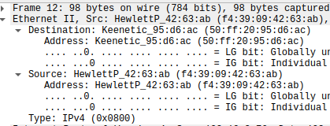
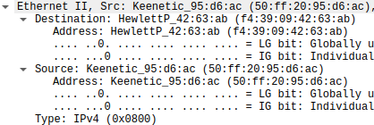
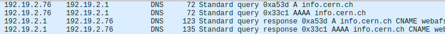
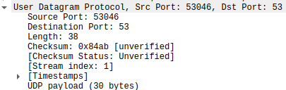
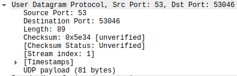
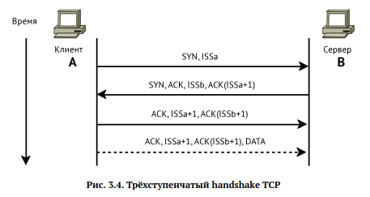

# Цели работы
Изучение посредством Wireshark кадров Ethernet, анализ PDU протоколов транспортного и прикладного уровней стека TCP/IP.

# Задача

## MAC-адресация

Найдем MAC-адрес одного из сетевых соединений.

```bash
$ ifconfig enp28s0 | rg "ether"
        ether f4:39:09:42:63:ab  txqueuelen 1000  (Ethernet)
```
Рассмотрим его структуру:

- f4:39:09 -- Organisationally Unique Identifier
    - f4
        - .... ..0. -- universally managed
        - .... ...0 -- unicast address

- 42:63:ab -- Network Interface Controller

## Анализ кадров канального уровня в Wireshark

### ICMP


### Рассмотрим пакеты ICMP Echo




### ARP


## Анализ протоколов транспортного уровня в Wireshark

### HTTP запрос к http://info.cern.ch/


### Запрос


### Ответ


### DNS запрос о info.cern.ch



### Запрос



### Ответ



## Анализ handshake протокола TCP в Wireshark

### Модель работы протокола:



### Протокол в действии:


# Вывод
Я изучил посредством Wireshark кадров Ethernet, проанализировал PDU протоколы транспортного и прикладного уровней стека TCP/IP.
