---
## Front matter
title: "Отчет по лабораторной работе 3"
subtitle: ""
author: "Матюхин Григорий, НПИбд-01-21, 1032211403"

## Generic otions
lang: ru-RU
toc-title: "Содержание"


## Pdf output format
toc: true # Table of contents
toc-depth: 2
lof: true # List of figures
lot: true # List of tables
fontsize: 12pt
linestretch: 1.5
papersize: a4
documentclass: scrreprt
## I18n polyglossia
polyglossia-lang:
  name: russian
  options:
	- spelling=modern
	- babelshorthands=true
polyglossia-otherlangs:
  name: english
## I18n babel
babel-lang: russian
babel-otherlangs: english
## Fonts
mainfont: PT Serif
romanfont: PT Serif
sansfont: PT Sans
monofont: PT Mono
mainfontoptions: Ligatures=TeX
romanfontoptions: Ligatures=TeX
sansfontoptions: Ligatures=TeX,Scale=MatchLowercase
monofontoptions: Scale=MatchLowercase,Scale=0.9
## Biblatex
biblatex: true
biblio-style: "gost-numeric"
biblatexoptions:
  - parentracker=true
  - backend=biber
  - hyperref=auto
  - language=auto
  - autolang=other*
  - citestyle=gost-numeric
## Pandoc-crossref LaTeX customization
figureTitle: "Рис."
tableTitle: "Таблица"
listingTitle: "Листинг"
lofTitle: "Список иллюстраций"
lotTitle: "Список таблиц"
lolTitle: "Листинги"
## Misc options
indent: true
header-includes:
  - \usepackage{indentfirst}
  - \usepackage{float} # keep figures where there are in the text
  - \floatplacement{figure}{H} # keep figures where there are in the text
---

# Цели работы
Изучение посредством Wireshark кадров Ethernet, анализ PDU протоколов транспортного и прикладного уровней стека TCP/IP.

# Задача

## MAC-адресация

Найдем MAC-адрес одного из сетевых соединений.

```bash
$ ifconfig enp28s0 | rg "ether"
        ether f4:39:09:42:63:ab  txqueuelen 1000  (Ethernet)
```
Рассмотрим его структуру:
- f4:39:09 -- Organisationally Unique Identifier
    - f4
        - .... ..0. -- universally managed
        - .... ...0 -- unicast address
- 42:63:ab -- Network Interface Controller

## Анализ кадров канального уровня в Wireshark

Рассмотрим пакеты ICMP Echo

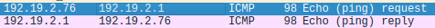

Можно заметить уже знакомый MAC-адрес моего соединения.
Данные пакеты мы отправляем моему Default Gateway -- роутеру.

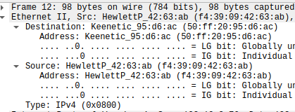
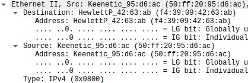

Используя ARP протокол роутер спрашивает у всез устройст информацию о них.
MAC-адрес -- `ff:ff:ff:ff:ff:ff` -- broadcast.

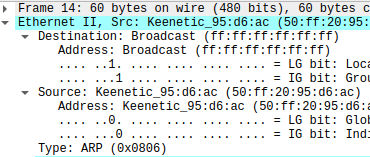

## Анализ протоколов транспортного уровня в Wireshark

HTTP запрос к http://info.cern.ch/

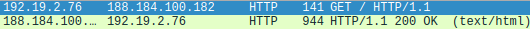

Запрос

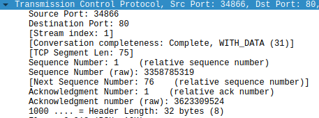

Ответ

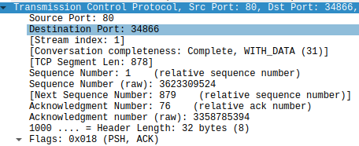

DNS запрос о info.cern.ch

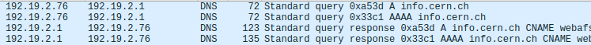

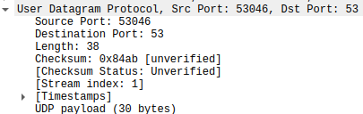

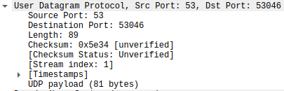

## Анализ handshake протокола TCP в Wireshark

Модель работы протокола:

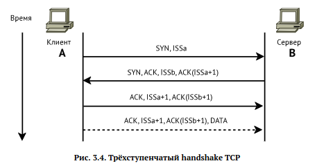

Протокол в действии:

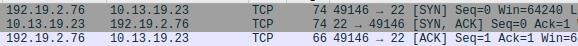

# Вывод
Я изучил посредством Wireshark кадров Ethernet, проанализировал PDU протоколы транспортного и прикладного уровней стека TCP/IP.
