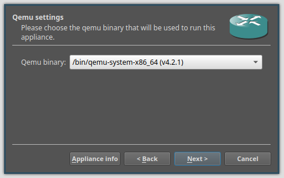
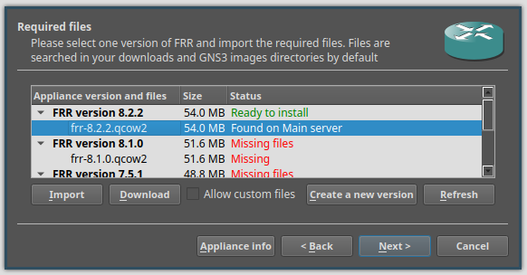

# Цели работы
Установка и настройка GNS3 и сопутствующего программного обеспечения.

# Задача
1. Установить GNS3-all-in-one, GNS3 VM, проверить корректность запуска;
2. Импортировать в GNS3 образ маршрутизатора FRR;
3. Импортировать в GNS3 образ маршрутизатора VyOS.

## Установка GNS3 на Arch Linux

```bash
pacman -Syu yay
```
```bash
yay -S qemu docker vpcs dynamips libvirt ubridge inetutils
```
```bash
yay -S gns3-server gns3-gui
```
```bash
sudo usermod -aG ubridge,libvirt,kvm $USER
```

## Установка GNS3 VM для QEMU/KVM

```bash
wget https://github.com/GNS3/gns3-gui/releases/download/ v<VERSION>/GNS3.VM.KVM.<VERSION>.zip
unzip GNS3.VM.KVM.<VERSION>.zip -d gns
cd gns
./start-gns3mv.sh
```

## GNS3 VM


## GNS3 Setup Wizard 1/2


## GNS3 Setup Wizard 2/2


## Импорт образа маршрутизатора 1/7


## Импорт образа маршрутизатора 2/7


## Импорт образа маршрутизатора 3/7


## Импорт образа маршрутизатора 4/7


## Импорт образа маршрутизатора 5/7


## Импорт образа маршрутизатора 6/7


## Импорт образа маршрутизатора 7/7


## Конфигурация маршрутизатора


# Вывод
Я установил и настроил GNS3 и сопутствующее программное обеспечение.
