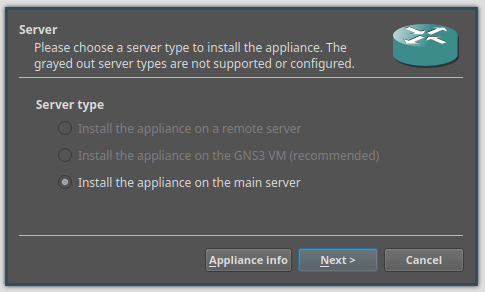

---
## Front matter
title: "Отчет по лабораторной работе 4"
subtitle: ""
author: "Матюхин Григорий, НПИбд-01-21, 1032211403"

## Generic otions
lang: ru-RU
toc-title: "Содержание"


## Pdf output format
toc: true # Table of contents
toc-depth: 2
lof: true # List of figures
lot: true # List of tables
fontsize: 12pt
linestretch: 1.5
papersize: a4
documentclass: scrreprt
## I18n polyglossia
polyglossia-lang:
  name: russian
  options:
	- spelling=modern
	- babelshorthands=true
polyglossia-otherlangs:
  name: english
## I18n babel
babel-lang: russian
babel-otherlangs: english
## Fonts
mainfont: PT Serif
romanfont: PT Serif
sansfont: PT Sans
monofont: PT Mono
mainfontoptions: Ligatures=TeX
romanfontoptions: Ligatures=TeX
sansfontoptions: Ligatures=TeX,Scale=MatchLowercase
monofontoptions: Scale=MatchLowercase,Scale=0.9
## Biblatex
biblatex: true
biblio-style: "gost-numeric"
biblatexoptions:
  - parentracker=true
  - backend=biber
  - hyperref=auto
  - language=auto
  - autolang=other*
  - citestyle=gost-numeric
## Pandoc-crossref LaTeX customization
figureTitle: "Рис."
tableTitle: "Таблица"
listingTitle: "Листинг"
lofTitle: "Список иллюстраций"
lotTitle: "Список таблиц"
lolTitle: "Листинги"
## Misc options
indent: true
header-includes:
 - \usepackage{indentfirst}
 - \usepackage{float} # keep figures where there are in the text
 - \floatplacement{figure}{H} # keep figures where there are in the text
 - \usepackage{fvextra}
 - \DefineVerbatimEnvironment{Highlighting}{Verbatim}{breaklines,commandchars=\\\{\}}
---
# Цели работы
Установка и настройка GNS3 и сопутствующего программного обеспечения.

# Задача
1. Установить GNS3-all-in-one, GNS3 VM, проверить корректность запуска;
2. Импортировать в GNS3 образ маршрутизатора FRR;
3. Импортировать в GNS3 образ маршрутизатора VyOS.

## Установка GNS3 на Arch Linux

Установим `yay` для доступа к AUR.
```bash
pacman -Syu yay
```
Установим необходимые пакеты.
```bash
yay -S qemu docker vpcs dynamips libvirt ubridge inetutils
```
Установим GNS3.
```bash
yay -S gns3-server gns3-gui
```
Добавимся в группы.
```bash
sudo usermod -aG ubridge,libvirt,kvm,docker $USER
```
Перезагрузим пк.

## Установка GNS3 VM для QEMU/KVM

Скачаем KVM версию с GitHub, распакуем архив и запустим скрипт.
```bash
wget https://github.com/GNS3/gns3-gui/releases/download/v<VERSION>/GNS3.VM.KVM.<VERSION>.zip
unzip GNS3.VM.KVM.<VERSION>.zip -d gns
cd gns
./start-gns3mv.sh
```

Окно информации о GNS3 VM:


Подключение к KVM серверу:


## Импорт образа маршрутизатора
Пошаговое импортирование образа маршрутизатора представлено ниже.
Все шаги идентичны как для FRR так и для VyOS маршрутизаторов.


Я устанавливаю для `main server`, которые находится на виртуальной машине.




В данном случае образ уже сохранен на сервере, но если его нет, то стоит нажать на кнопку Download. Это откроет страницу в браузере, где можно будет скачать все необходимое.


## Конфигурация маршрутизатора

Последним шагом является конфигурация установленного изображения.

На первой вкладке необходимо поменять действие по умолчанию при закрытие GNS.


А на вкладке HDD необходимо установить автоматическое создание диска конфигурации.


# Вывод
Я установил и настроил GNS3 и сопутствующее программное обеспечение.

