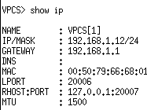
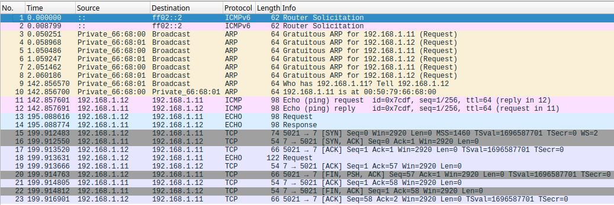
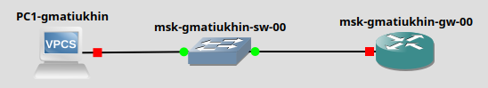
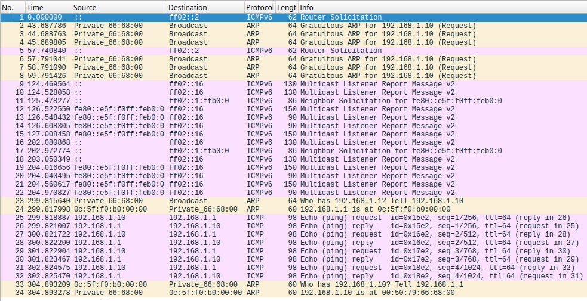
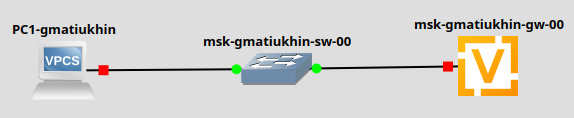

# Цели работы
Построение простейших моделей сети на базе коммутатора и маршрутизаторов FRR и VyOS в GNS3, анализ трафика посредством Wireshark.

# Задача
1. Моделирование простейшей сети на базе коммутатора в GNS32.
1. Анализ трафика в GNS3 посредством Wireshark
1. Моделирование простейшей сети на базе маршрутизатора FRR в GNS3 
1. Моделирование простейшей сети на базе маршрутизатора VyOS в GNS3

# Моделирование простейшей сети на базе коммутатора в GNS32.

## Сеть

## Конфигурация VPCS

## Проверка соединения

# Анализ трафика в GNS3 посредством Wireshark

# Моделирование простейшей сети на базе маршрутизатора FRR в GNS3 

## Сеть

## Анализ трафика

# Моделирование простейшей сети на базе маршрутизатора VyOS в GNS3

## Сеть

## Анализ трафика

# Вывод
Я построенил простейшиу моделеи сети на базе коммутатора и маршрутизаторов FRR и VyOS в GNS3, проанализировал трафик посредством Wireshark.
