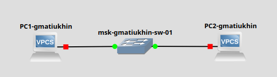
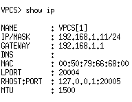
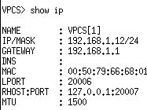
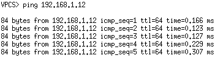
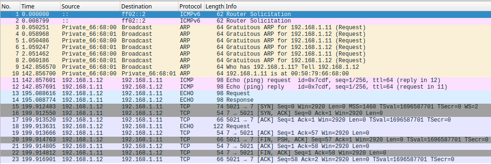
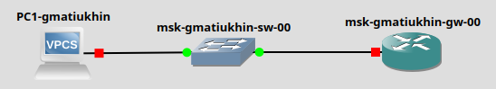
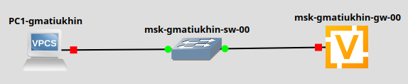
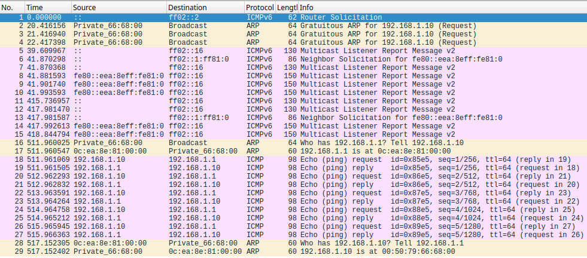

---
## Front matter
title: "Отчет по лабораторной работе 5"
subtitle: ""
author: "Матюхин Григорий, НПИбд-01-21, 1032211403"

## Generic otions
lang: ru-RU
toc-title: "Содержание"

## Pdf output format
toc: true # Table of contents
toc-depth: 2
lof: true # List of figures
lot: true # List of tables
fontsize: 12pt
linestretch: 1.5
papersize: a4
documentclass: scrreprt
## I18n polyglossia
polyglossia-lang:
  name: russian
  options:
	- spelling=modern
	- babelshorthands=true
polyglossia-otherlangs:
  name: english
## I18n babel
babel-lang: russian
babel-otherlangs: english
## Fonts
mainfont: PT Serif
romanfont: PT Serif
sansfont: PT Sans
monofont: PT Mono
mainfontoptions: Ligatures=TeX
romanfontoptions: Ligatures=TeX
sansfontoptions: Ligatures=TeX,Scale=MatchLowercase
monofontoptions: Scale=MatchLowercase,Scale=0.9
## Biblatex
biblatex: true
biblio-style: "gost-numeric"
biblatexoptions:
  - parentracker=true
  - backend=biber
  - hyperref=auto
  - language=auto
  - autolang=other*
  - citestyle=gost-numeric
## Pandoc-crossref LaTeX customization
figureTitle: "Рис."
tableTitle: "Таблица"
listingTitle: "Листинг"
lofTitle: "Список иллюстраций"
lotTitle: "Список таблиц"
lolTitle: "Листинги"
## Misc options
indent: true
header-includes:
 - \usepackage{indentfirst}
 - \usepackage{float} # keep figures where there are in the text
 - \floatplacement{figure}{H} # keep figures where there are in the text
 - \usepackage{fvextra}
 - \DefineVerbatimEnvironment{Highlighting}{Verbatim}{breaklines,commandchars=\\\{\}}
---
# Цели работы
Построение простейших моделей сети на базе коммутатора и маршрутизаторов FRR и VyOS в GNS3, анализ трафика посредством Wireshark.

# Задача
1. Моделирование простейшей сети на базе коммутатора в GNS32.
1. Анализ трафика в GNS3 посредством Wireshark
1. Моделирование простейшей сети на базе маршрутизатора FRR в GNS3 
1. Моделирование простейшей сети на базе маршрутизатора VyOS в GNS3

## Моделирование простейшей сети на базе коммутатора в GNS32.

Создадим нашу сеть для данного задания:

Установим необходимые IP для VPCS

Конфигурация VPCS

Используя `ping` проверим, что VPCS соединены между собой.

## Анализ трафика в GNS3 посредством Wireshark

Мониторим сеть из предыдущей части с помощью Wireshark.

No|ECHO
---|---
11,12| ICMP ECHO
13,14| UDP ECHO
15-23| TCP ECHO

## Моделирование простейшей сети на базе маршрутизатора FRR в GNS3 

Новая сеть:

Device|IP
------|--
PC1-gmatiukhin|192.168.1.10
msk-gmatiukhin-gw-00|192.168.1.1

### Анализ трафика

No|Info
---|---
23,24| ARP broadcast запрос о IP 192.168.1.1 
25-32| ICMP ECHO
33,34| ARP запрос о IP 192.168.1.10

## Моделирование простейшей сети на базе маршрутизатора VyOS в GNS3

Сеть

Device|IP
------|--
PC1-gmatiukhin|192.168.1.10
msk-gmatiukhin-gw-00|192.168.1.1

Анализ трафика

No|Info
---|---
16,17| ARP broadcast запрос о IP 192.168.1.1 
18-27| ICMP ECHO
28,29| ARP запрос о IP 192.168.1.10

# Вывод
Я построенил простейшиу моделеи сети на базе коммутатора и маршрутизаторов FRR и VyOS в GNS3, проанализировал трафик посредством Wireshark.

