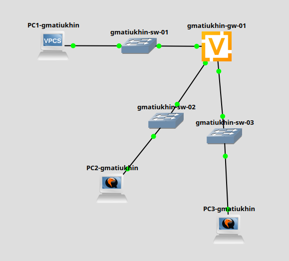
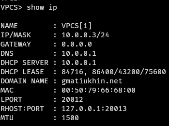
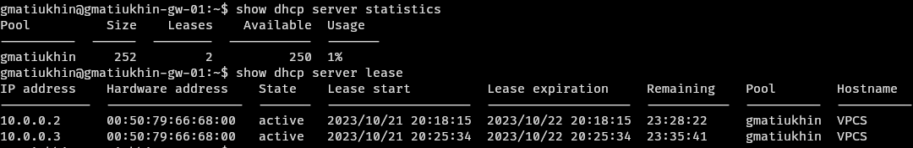
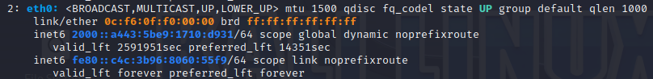
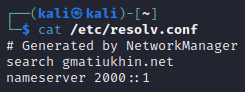
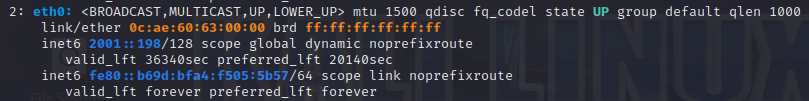
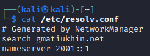

# Цель
Получение навыков настройки службы DHCP на сетевом оборудовании для распределения адресов IPv4 и IPv6.

# Задача
- Настройка DHCP в случае IPv4
- Настройка DHCP в случае IPv6
    - без отслеживания состояния
    - с отслеживанием состояния

# Выполнение

## Топология сети


## Настройка DHCP в случае IPv4

```
dhcp-server {
    shared-network-name gmatiukhin {
        domain-name gmatiukhin.net
        name-server 10.0.0.1
        subnet 10.0.0.0/24 {
            range hosts {
                start 10.0.0.2
                stop 10.0.0.253
            }
        }
    }
}
```
## PC


## Статистика


## Настройка DHCP в случае IPv6 без отслеживания состояния

```
dhcpv6-server {
    shared-network-name gmatiukhin-stateless {
        common-options {
            domain-search gmatiukhin.net
            name-server 2000::1
        }
        subnet 2000::0/64 {
        }
    }
}
```

## Router advert
```
router-advert {
    interface eth1 {
        other-config-flag
        prefix 2000::/64 {
        }
    }
}
```

## IP, DNS



## Настройка DHCP в случае IPv6 с отслеживанием состояния

```
dhcpv6-server {
    shared-network-name gmatiukhin-stateful {
        subnet 2001::0/64 {
            address-range {
                start 2001::100 {
                    stop 2001::199
                }
            }
            domain-search gmatiukhin.net
            name-server 2001::1
        }
    }
}
```

## Router advert
```
router-advert {
    interface eth2 {
        managed-flag
    }
}
```

## IP, DNS



# Вывод
Я получил навыки настройки службы DHCP на сетевом оборудовании для распределения адресов IPv4 и IPv6.
