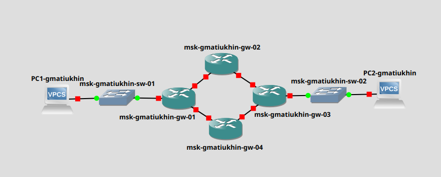
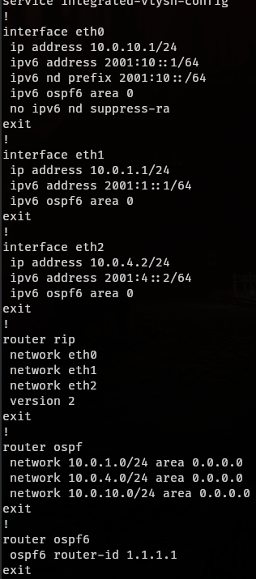
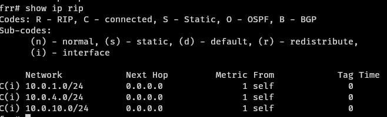
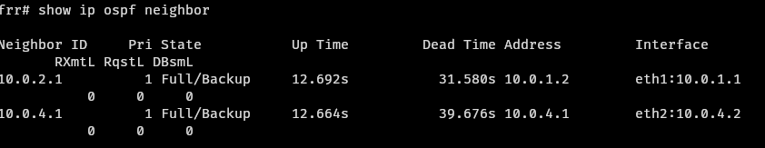
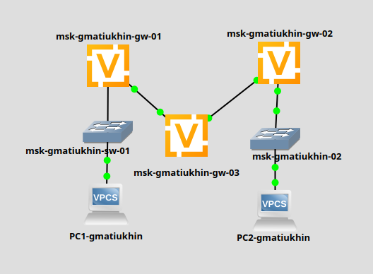
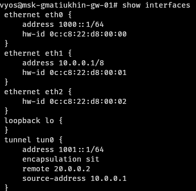
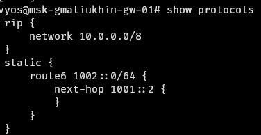
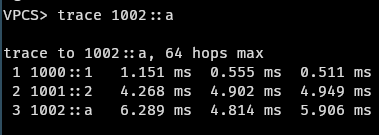

# Цели работы
Изучение принципов маршрутизации в IPv4- и IPv6-сетях и принципов настройки сетевого оборудования

# Задача
1. Настройка динамической маршрутизации в сетях IPv4 и IPv6
2. Построение туннеля IPv6–IPv4
3. Задание для самостоятельного выполнения

# Выполнение

# Настройка динамической маршрутизации в сетях IPv4 и IPv6

Топология сети

## Таблица адресов сетей:
Устройства|Сеть IPv4|Сеть IPv6
----------|---------|----------
PC1 – gw-01|10.0.10.0/24|2001:10::/64
PC2 – gw-03|10.0.11.0/24|2001:11::/64
gw-01 – gw-02|10.0.1.0/24|2001:1::/64
gw-02 – gw-03|10.0.2.0/24|2001:2::/64
gw-03 – gw-04|10.0.3.0/24|2001:3::/64
gw-04 – gw-01|10.0.4.0/24|2001:4::/64

## Пример настройки роутера:

## Проверка `rip`:

## Проверка `ospf`:

# Построение туннеля IPv6–IPv4

## Топология сети

## Пример настоики интерфейсов и протоколов на одном из роутеров:

## Пример настоики интерфейсов и протоколов на одном из роутеров:

## Результат

# Вывод
Я изучил принципы маршрутизации в IPv4- и IPv6-сетях и принципы настройки сетевого оборудования

