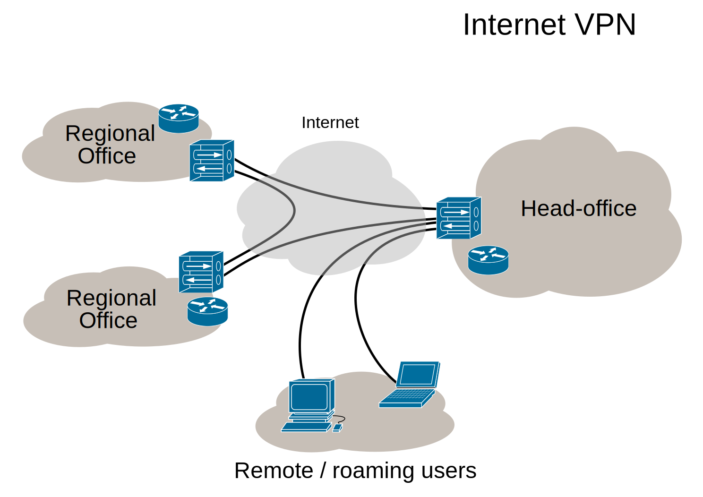

# Интранет и виртуальные частные сети 

Выполнил: Матюхин Григорий

---

## Что такое Интранет?

---

### Простой пример

---

## Применения

---

## Недостатки
- Содтрудники на "удаленке" не именют доступа
- Новый офис в другом городе не имеет доступа
- Компания-партнер не имеет доступа

---

## Виртуальная частная сеть

---

### Категоризация VPN

- Удаленный доступ
- Сеть-сеть
- Сеть-сеть для экстрасети

---

---

## Устройство PPVPN 

---

# Спасибо за внимание
