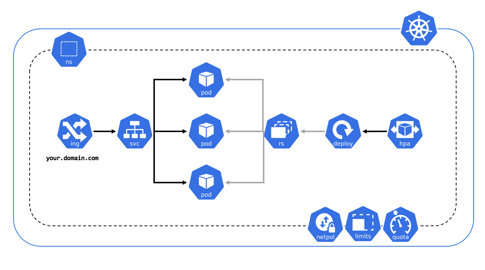

# Оркестрация контейнеров промышленного уровня на базе Kubernetes 

Выполнил: Матюхин Григорий

---

## Немного истории

---

---

## Архитектура

---

## Сетевая модель

---

## Сервисы

---

## Ingress

---

# Спасибо за внимание
