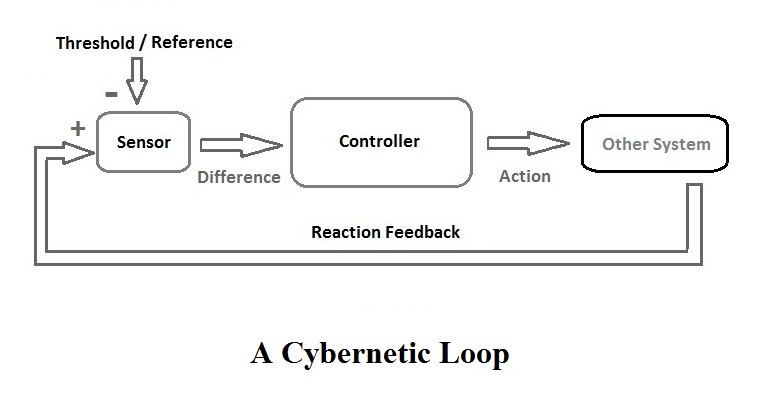
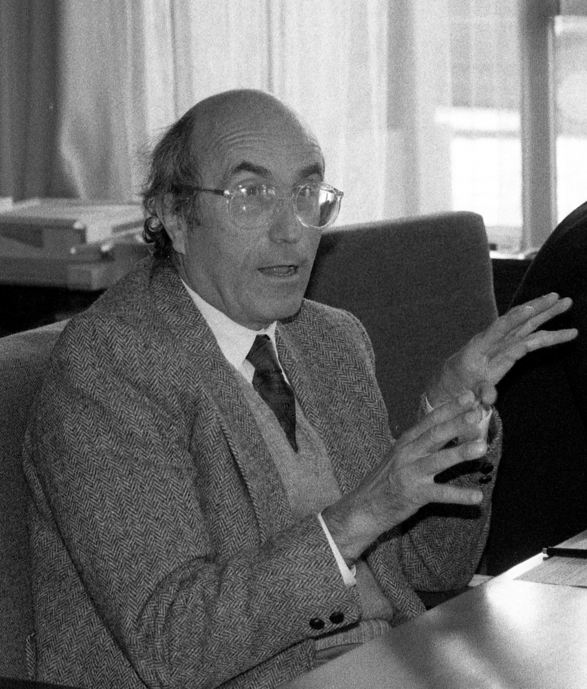

# Методы кибернетики для описания социальных систем

Выполнил: Матюхин Григорий

---

## Кибернетика

Кибернетика (от др.-греч. κυβερνητική «искусство управления») — наука об общих закономерностях получения, хранения, преобразования и передачи информации в сложных управляющих системах, будь то машины, живые организмы или общество.

<!--

Кибернетика (от др.-греч. «искусство управления») --- наука об общих закономерностях получения, хранения, преобразования и передачи информации в сложных управляющих системах, будь то машины, живые организмы или общество.

Кибернетика включает изучение обратной связи, чёрных ящиков и производных концептов, таких как управление и коммуникация в живых организмах, машинах и организациях, включая самоорганизации. Она фокусирует внимание на том, как что-либо (цифровое, механическое или биологическое) обрабатывает информацию, реагирует на неё и изменяется или может быть изменено, для того чтобы лучше выполнять первые две задачи
-->

---

## Петли обратной связи

<!--
Кибернетические методы применяются при исследовании случая, когда действие системы в окружающей среде вызывает некоторое изменение в окружающей среде, а это изменение проявляется на системе через обратную связь, что вызывает изменения в способе поведения системы. В исследовании этих «петель обратной связи» и заключаются методы кибернетики.
-->

---

## Кибернетика второго порядка

Кибернетика второго порядка, также известная как кибернетика кибернетики, является рекурсивным приложением кибернетики к самой себе.

<!--
Кибернетика второго порядка, также известная как кибернетика кибернетики, является рекурсивным приложением кибернетики к самой себе. Хейнц фон Фёрстер в статье «Cybernetics of Cybernetics» 1974 года, провёл различие между кибернетикой первого порядка — кибернетикой наблюдаемых систем, и кибернетикой второго порядка — кибернетикой наблюдающих систем.

Ключевая концепция кибернетики второго порядка заключается в том, что наблюдателей (и другие действующие лица, таких как дизайнеры, моделисты, пользователи...) следует понимать как участников систем, с которыми они взаимодействуют, в отличие от отстраненности, подразумеваемой объективностью в отличие от традиционной научной практики. Это включает в себя включение самих кибернетиков в практику кибернетики, а также вовлечение участников в рассмотрение и проектирование систем в более общем плане.
-->

---

## Социальная кибернетика
Социальная кибернетика (англ. sociocybernetics) — независимый раздел в социологии, основанный на общей теории систем и кибернетике.

<!--
Социальная кибернетика или социокибернетика (англ. sociocybernetics) — независимый раздел в социологии, основанный на общей теории систем и кибернетике.

Термин «социо» в названии социокибернетики относится к любой социальной системе, как это определено, среди прочего, Талкоттом Парсонсом и Никласом Луманом, о ком мы поговорим в дальнейшем.

Основная цель создания социальной кибернетики — создание теоретической основы и инструментов информационной технологии для преодоления проблем, с которыми на сегодняшний день сталкиваются отдельные личности, пары, семьи, компании, организации, страны и международные отношения.

Социальная кибернетика может быть определена как «Системная наука в социологии и других социальных науках» — системная наука потому что социальная кибернетика не ограничена теорией, а включает в себя так же и практическое применение, эмпирические исследования, методологию, аксиологию и эпистемологию. В общем употреблении «теория систем» и «кибернетика» зачастую взаимно заменяются или используются в комбинации. Таким образом они могут считаться синонимами хотя эти два определения имеют разные корни.

Социальная кибернетика включает в себя как кибернетику первого, так и второго порядков. Пусть социология и является центром внимания социальной кибернетики, остальные социальные науки такие как психология, антропология, политология, экономика тоже упоминаются с уклоном, зависящим от постановки научного вопроса.
-->

---

# Теория социальных систем Никласа Люмана

<!--
Теория социальных систем Лумана фокусируется на трех темах, которые взаимосвязаны во всей его работе.
- Теория систем как теория общества
- Теория коммуникации
- Теория эволюции

1. Социальные системы — это системы коммуникации. Система определяется границей между собой и окружающей средой, отделяющей ее от бесконечно сложной или (в разговорной речи) хаотичной внешней среды. Таким образом, внутренняя часть системы представляет собой зону пониженной сложности: коммуникация внутри системы осуществляется путем выбора только ограниченного количества всей информации, доступной снаружи. Этот процесс еще называют «уменьшением сложности».

2. Более того, каждая система имеет свою отличительную идентичность, которая постоянно воспроизводится в ее коммуникации и зависит от того, что считается значимым, а что нет. Если системе не удается сохранить эту идентичность, она перестает существовать как система и растворяется обратно в среде, из которой возникла.

3. Под влиянием кибернетики второго порядка Луман рассматривает системы как аутопойетические("самотворящие") и оперативно закрытые. Системы должны постоянно конструировать себя и свою точку зрения на реальность, осознавая различие между системой и окружающей средой, и самовоспроизводить себя как продукт своих собственных элементов.
-->

---

# Средства массовой информации с точки зрения теории систем Никласа Лумана и социокибернетики

<!--
Еще в 1990 году Никлас Луман утверждал, что «если изменятся средства массовой информации и методы общения, если изменятся возможности и чувствительность выражения, если коды изменятся с устного общения на письменное и, прежде всего, если возможности воспроизведения и хранения увеличатся, новые структуры становятся возможными и, в конечном итоге, необходимыми, чтобы справиться с новыми сложностями".

В этом смысле теоретический аппарат социокибернетики, понимаемой здесь как наука о социальных системах и конструктивистская парадигма, основанная на кибернетике второго порядка, дает ряд концепций и указаний, которые позволяют нам наблюдать это состояние сложности через саму сложность. Это означает описание общества и его функциональных систем как позиций, с которых можно наблюдать сложность, а не как контекстов, которые каким-то образом пытаются разрешить ее путем ее уменьшения.

Наблюдать за средствами массовой информации сегодня — значит принимать во внимание то, как центральную роль средств массовой информации в контексте мирового общества следует рассматривать по отношению к коммуникативной среде, создаваемой Интернетом.
-->

---

## Функция СМИ

«Система может работать с информацией. Информация, таким образом, представляет собой положительную ценность, обозначающую ценность, с помощью которой система описывает возможности своего собственного функционирования. Но для того, чтобы иметь свободу видеть что-то как информацию или нет, должна быть также возможность думать, что что-то неинформативно»

<!--
В рамках теоретической основы общей теории социальных систем Луман выделяет средства массовой информации, с одной стороны, как специфическую функциональную систему, самореферентную и автопоэзную, а с другой — различные средства распространения массовой коммуникации.

Функция системы средств массовой информации заключается в создании общей для всех второй реальности — базовых знаний, которые можно воспринимать как нечто само собой разумеющееся (например, если мы упомянем чемпионат мира по футболу 2018 года, слушатели поймут, о чем мы говорим, даже если они к сами к чемпионату не причастны). Это необходимо для того, чтобы производить новые коммуникации без необходимости начинать все заново. Конструирование реальности средствами массовой информации проистекает из наблюдения второго порядка, поскольку, наблюдая за средствами массовой информации, человек наблюдает то, что наблюдают другие. Тем не менее, это не реальность, которая требует консенсуса: она касается только того, что наблюдается, а не того, как наблюдается.

Темы коммуникации необходимы для синхронизации средств массовой информации и общества без ущерба для работоспособности системы. Внутри системы темы представляют собой гетерореференцию коммуникации: средства массовой информации говорят о такой теме, как здоровье, и таким образом вступают в связь с медицинской системой.

Луман приводит пример СПИДа, чтобы показать, что эта тема «не является продуктом самих средств массовой информации». Они просто воспринимают ее, а затем обращаются с ней определенным образом, подчиняя тематическую траекторию, которую нельзя объяснить ни медицинскими диагнозами, ни общением между врачами и пациентами»[11]. Таким образом, темы гармонизируют гетерореференцию (отсылку к внешнему миру) и самореференцию (отсылку внутрь медиа, его функции) внутри собственной коммуникации системы. Поэтому темы важны для структурной связи средств массовой информации с другими социальными системами.
-->

---

# Модели в социальной кибернетике

<!--
Тепер мы знаем достатосно о кибернетике, социальной кибернетике и о социальных системач, чтообы поговорить о некоторых методологиях, применяемых учеными.

В тех немногих случаях, когда социокибернетики действительно проверяли свои теории эмпирически, они использовали две разные стратегии[12]: стратегию операционализации и модельную стратегию.

 В первой стратегии социокибернетик извлекает из теории набор предсказаний, каждое из которых можно проверить статистическими тестами. Во второй стратегии проверяемая теория	не разбивается на набор предсказаний, а полностью переводится в компьютерную симуляционную модель, а затем проверяется путем проверки, может ли модель воспроизвести те самые процессы, которые теория, как предполагается, объясняет.
 -->

---

## Подход к создаию моделей в социокибернетике

1. Представляем самоссылающийся элемент управления.
1. Учет возмущений со стороны окружающей среды.
1. Представляет целеустремленность.
1. Учитываем морфогенез.

<!--
Тогда социокибернетикам нужны модели для проверки своих теорий, задача кибернетики первого порядка, но они должны сосредоточиться на цели разработчика модели, а не на модели, чтобы иметь задачу второго порядка, и это сложная, а иногда и конфликтная ситуация.

Идей по включению социокибернетических идей в модель немного, и они в основном связаны с назначением модели. Одним подходом служит четырехэтапный метод, предложенный ван дер Зувеном

1. Представляем самоссылающийся элемент управления.
    Между переменными состояния и их входными и выходными переменными добавляются петли обратной связи.
2. Учет возмущений со стороны окружающей среды.
    Очень маловероятно, чтобы система функционировала в полностью статичной среде; можно было бы, по крайней мере, ожидать, что произойдут некоторые случайные возмущения.
3. Представляет целеустремленность.
    Поскольку основной концепцией кибернетики является управление, для кибернетических моделей важно, чтобы они отражали целенаправленное поведение.
4. Учитываем морфогенез.
    Предполагается, что социальные системы имеют возможность изменять свою структуру в процессе своего функционирования.

МОДЕЛИ НЕ ИДЕАЛЬНЫ

Предстоящая задача — лучше понять и перевести концепции социокибернетики в модели,которые можно будет протестировать с помощью компьютерного моделирования. Однако, как признал ван дер Зувен, основные концепции, такие как самоорганизация, самовоспроизведение или самореференция, трудно перевести в набор уравнений.

Следствием этого является необходимость создания нового моделирования и новых методологий тестирования моделей, чтобы предоставить социокибернетикам средства для адекватной проверки своих представлений о мире.
-->

---

# PAR

Исследование совместных действий (participatory action research, PAR) — это подход к исследованию действий, в котором особое внимание уделяется участию и действиям членов сообществ, затронутых этим исследованием.

<!--
PAR делает упор на коллективные исследования и эксперименты, основанные на опыте и социальной истории. В рамках процесса PAR «сообщества исследований и действий развиваются и решают вопросы и проблемы, которые важны для тех, кто участвует в качестве соисследователей». PAR контрастирует с обычными методами исследования, которые делают упор на контролируемое экспериментирование, статистический анализ и воспроизводимость результатов.

Мы учитываем то, как исследователи и члены социальной среды влияют на нее [социальную среду, которую они исследуют].

PAR использовался как методология социального вмешательства, которая сочетает в себе исследования ученых и действия по анализу и вмешательству в сложные социальные проблемы.

PAR подчеркивает важность участия участников в систематизации и анализе данных для достижения социальных преобразований, и, таким образом, частью цели исследовательской модели является повышение их организационного потенциала для генерации информации и знаний по вопросам, которые коллективно определены как актуальные.

PAR делает упор на наблюдении за действиями, производимыми в процессе исследования, социокибернетика фокусируется на наблюдении за действиями и процессами внутри анализируемой системы – самого исследования – и, на следующем этапе, на размышлении, полученном в результате метанаблюдения за процессом наблюдения.

Тем самым они дополняют друг друга.

Рассматривая PAR как систему наблюдения, социокибернетика обеспечивает наблюдение второго порядка, которое наблюдает за исследовательским процессом, составляющим саму систему наблюдения. В рамках PAR это требует интеграции регистрации и анализа всего процесса, что поможет сделать обучение системы более подотчетным.
-->

---

# Спасибо за внимание
